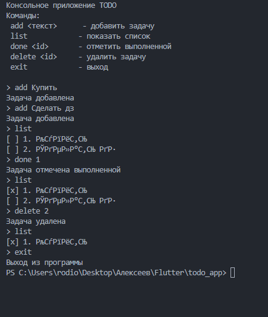

# Лабораторная работа: Введение в Dart и Flutter

## Описание проекта
Консольное приложение-менеджер задач (ToDo List), разработанное на языке Dart. Проект демонстрирует основы языка, работу с асинхронностью и использование сторонних пакетов.

## Автор
Алексвеев Григорий, группа ИСП-232



## Как запустить проект

### Требования
* Dart SDK версии 3.0+
* Git
* Редактор кода (рекомендуется VS Code)

### Установка и запуск
```bash

# Клонируйте репозиторий
git clone <URL-репозитория>

# Перейдите в директорию проекта
cd todo_app

# Запустите приложение
dart run
```

### Что изучили в ходе работы
 * Основы языка Dart:
  * Система типов и Null Safety
  * Синтаксис и особенности языка
  * Классы и объекты
 * Работа с асинхронностью через Future и async/await
 * Использование сторонних пакетов
 * Основы работы с Git и GitHub
 * Создание консольного приложения

### Вопросы и ответы

 1. **final** vs **const**:
   * **final** — неизменяемая переменная, значение которой известно во время выполнения
   * **const** — константа времени компиляции

2. **String?** — nullable-тип, который может принимать значение null

3. **Future** — объект, представляющий результат асинхронной операции. **await** приостанавливает выполнение функции до получения результата, не блокируя основной поток.

4. Именованные конструкторы используются вместо перегрузки, так как позволяют создавать разные варианты инициализации объекта через именованные версии.
